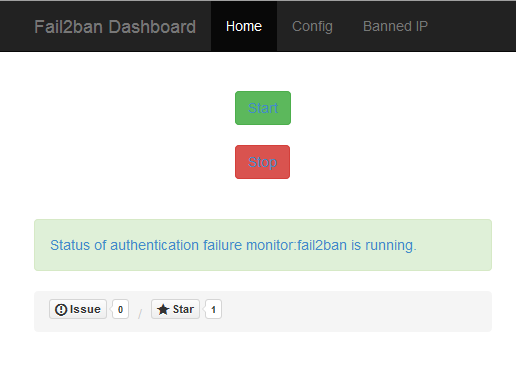
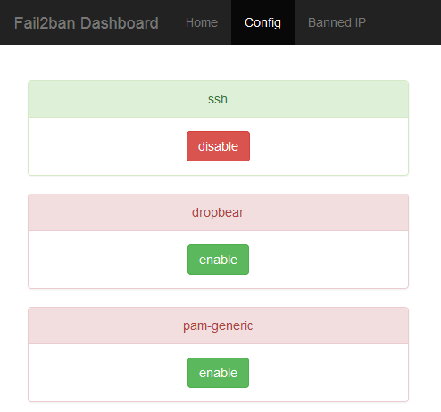
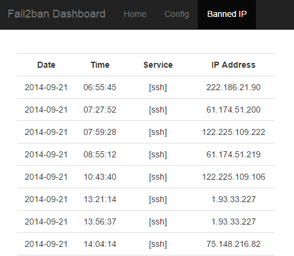

fail2ban-dashboard
==================
[](https://travis-ci.org/oussemos/fail2ban-dashboard)

Fail2ban web dashboard written with Flask framework


### Quick Start

1. Clone the repo
  ```
  $ git clone https://github.com/oussemos/fail2ban-dashboard.git
  $ cd fail2ban-dashboard
  ```

2. Initialize and activate a virtualenv:
  ```
  $ virtualenv --no-site-packages env
  $ source env/bin/activate
  ```

3. Install the dependencies:
  ```
  $ pip install -r requirements.txt
  ```

5. Run the development server:
  ```
  $ python home.py
  ```

6. Navigate to [http://localhost:5000](http://localhost:5000)

login: ouss
password: pass


### Deployment 

For more stability, you can deploy the application with Gunicorn.

  ```
  $ pip install gunicorn
  $ gunicorn home:app -p fail2ban_dashboard.pid -b 0.0.0.0:5000 -D
  ```

### Issues

* The application is still under development, don't hesitate to give advice, open an <a href="https://github.com/oussemos/fail2ban-dashboard/issues">issue</a> or contribute.


### System

* This app was developed and tested under Debian Wheezy


### Screenshots







### Changelog

(28-10-2014) : new features

* Filters configuration
* Authentification with password

### Bonus

(15-11-2014)

* A Docker fail2ban-dashboard preconfigured container based on Debian Wheezy
```
$ docker pull oussemos/fail2ban-dashboard
```

### Author

<a href="http://oussema.cherni.tn">Oussema Cherni</a> (@<a href="http://twitter.com/oussemos">oussemos</a> on Twitter)

### License

Open source licensed under the MIT license.


